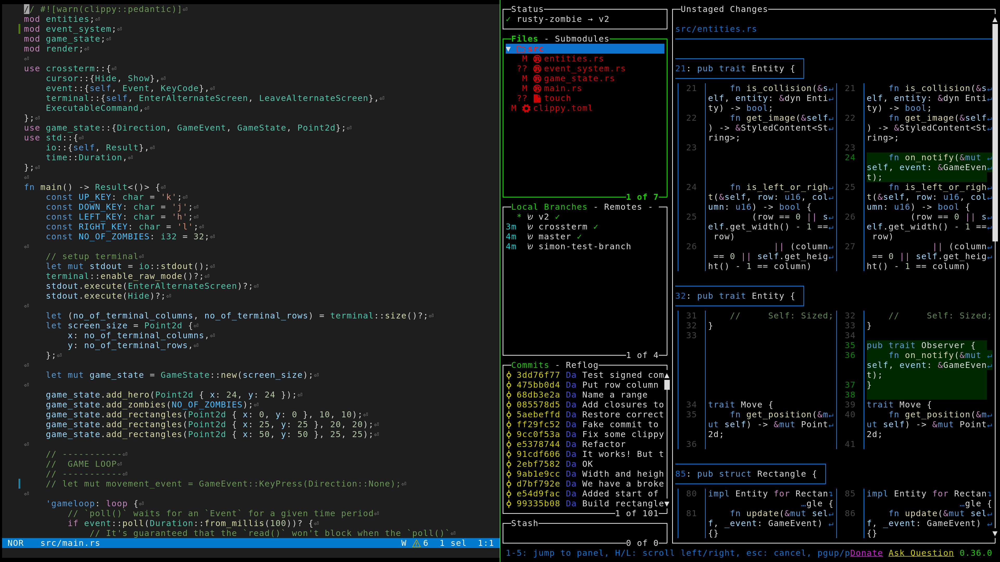

## Kitty Terminal Project Launcher

Easily open and manage your local coding projects inside
[kitty terminal](https://github.com/kovidgoyal/kitty).



### Features:

- Fuzzy search for all or just recent projects using
  [fzf](https://github.com/junegunn/fzf).
- Open projects with your default terminal editor.
- Open preconfigured sets of named windows for different project types.
- Automatic closing of windows when exiting your editor.

### Configuration

1. Edit the script to point to your project folders and select the `maxdepth`
   you wish to search:

```sh
a) items=$(find ~/Documents/business ~/Documents/personal ~/Documents/apps-sites -maxdepth 2 -mindepth 1 -type d) ;;
```

```
├── Documents
│   ├── apps-sites
│   │   └── project-1 < maxdepth 2 stops searching here
│   ├── business
│   │   ├── project-1
│   └── personal
│       └── project-2

The search results will be:

- project-1
- project-2
- project-3
```

2. Decide on which terminal windows to open based on which files or directories
   are in the project root.

```
├── Documents
│   ├── apps-sites
│   │   └── project-1
│   │       ├── src
│   │       │   ├── modules
│   │       │   │   ├── model.js
│   │       │   │   └── view.js
│   │       │   └── main.js
│   │       ├── package.json < detects JS/TS in project root
│   │       ├── README.md
│   │       └── .gitignore
```

For example, to open an additional terminal window for Rust and JS/TS projects
the included default is:

```sh
    if [ -f "Cargo.toml" ] || [ -f "package.json" ]; then
        kitty @ launch --title "Terminal:$project_name" --keep-focus --cwd="$selected_dir"
    fi
```

Make sure to close them again at the end of the script:

```sh
kitty @ close-window --match title:^"Terminal:$project_name" --ignore-no-match
```

3. To achieve the recommended workflow, add the following to your `kitty.conf`
   file:

```sh
enabled_layouts       stack,tall
```

Now you can easily toggle each window between full screen and split screen with
`ctrl+shift l`

If you find it easier to use just `ctrl` than `ctrl+shift` then the following
remapping is recommended:

```sh
map ctrl+t launch --cwd=current --type=tab
map ctrl+enter launch --cwd=current
map ctrl+1 first_window
map ctrl+2 second_window
map ctrl+3 third_window
map ctrl+4 fourth_window
map ctrl+5 fifth_window
map ctrl+6 sixth_window
map ctrl+] next_window
map ctrl+[ previous_window
```

### Usage:

1. Copy the `ep` script into your `$PATH`.
2. Run the command `ep` in your terminal.
3. Follow the prompts to search and open your desired project.
4. Start coding in your preconfigured and organized workspace.
5. Quit using your editor to close the other windows.

Requirements:

- [Kitty terminal](https://github.com/kovidgoyal/kitty).
- [fzf](https://github.com/junegunn/fzf).

Optional requirements:

- [Lazygit](https://github.com/jesseduffield/lazygit).
